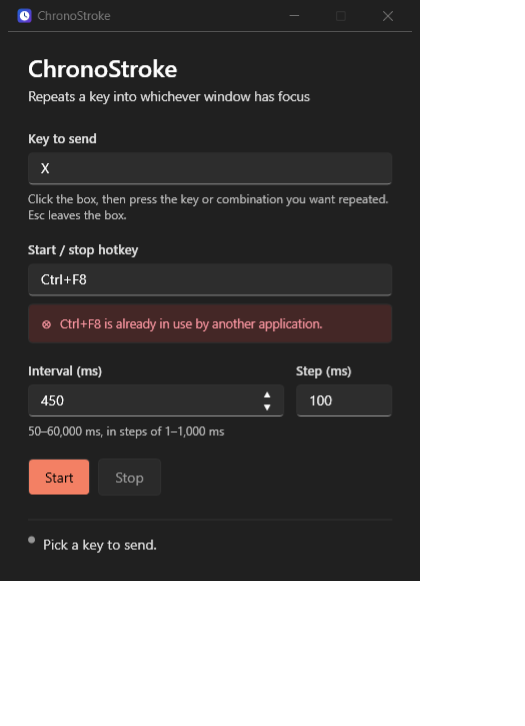

# ChronoStroke

A small Windows 11 desktop utility that repeatedly sends a key or key combination to whichever
window currently has focus, at an interval you choose, started and stopped with a global hotkey.


Single window, no background service, no telemetry, no network access of any kind.



## Why this exists

Sending synthetic keystrokes on Windows is easy to get *almost* right. `SendKeys.Send` and
virtual-key injection work fine in Notepad and a browser, then do nothing at all in a game,
because games that read input through DirectInput or Raw Input look at **scan codes** — what
the keyboard hardware actually puts on the wire — not at the virtual-key codes those APIs send.

ChronoStroke injects scan codes through `SendInput`, so the same keystroke works in a text box
and in a 3D game.

## Features

- **Any key or combination** — press `X`, `Ctrl+Shift+E`, `Alt+F4` if you must, straight into a
  capture field. No dropdown of keys to hunt through.
- **Configurable interval** with a 50 ms floor, so a stray keypress cannot flood the input queue
  faster than windows can drain it.
- **Global start/stop hotkey** that works while another window has focus.
- **Settings persist** between runs.
- **Clean shutdown** — hotkeys unregistered, timers stopped, no key left held down.
- **Follows your Windows light/dark theme.**

## Requirements

- Windows 11 (Windows 10 should work but is untested)
- x64

Nothing to install — the published build is a single self-contained `.exe` with no runtime
prerequisite.

## Getting started

### Download

Grab `ChronoStroke.exe` from the [latest release](https://github.com/albertm360/chronostroke/releases/latest).
It is a single self-contained file — copy it anywhere and run it. The release page carries a SHA-256
checksum, and what changed in each version is in [CHANGELOG.md](CHANGELOG.md).

### Build from source

Requires the [.NET 10 SDK](https://dotnet.microsoft.com/download).

```
git clone https://github.com/albertm360/chronostroke.git
cd chronostroke
dotnet publish -c Release
```

The result is one file:

```
ChronoStroke\bin\Release\net10.0-windows\win-x64\publish\ChronoStroke.exe
```

Copy it anywhere and run it. To iterate on the code instead, `dotnet run --project ChronoStroke`.

## Usage

1. **Key to send** — click the box and press the key or combination you want repeated.
2. **Start / stop hotkey** — click the box and press the combination that will toggle the loop.
   Defaults to `Ctrl+F8`.
3. **Interval (ms)** — how long to wait between presses. Minimum 50, maximum 60000.
4. Click **Start**, or press your hotkey from anywhere.

A capture box records *every* key you press into it, `Tab` and `Space` included — that is what
lets them be chosen. **Press `Esc` to leave a capture box** and carry on with the keyboard.

**A combination is replaced, not cleared.** Press a different key into the box and it takes over;
there is no button to empty one, because an empty box only ever means Start is unavailable. If a
box does read `(not set)`, the saved value was rejected when the app loaded it — see
[Where settings live](#where-settings-live) — and pressing any key fixes it.

Once running, switch to the target window and the keystrokes follow your focus. Press the hotkey
again to stop.

**The first keystroke waits until you let go of the hotkey.** This is deliberate: anything you
are still physically holding gets folded into the injected keystroke, so starting with `Ctrl+F8`
while sending `X` would deliver `Ctrl+X` to the target window. If the wait lasts more than a
moment the status line says so.

### Where settings live

```
%AppData%\ChronoStroke\settings.json
```

Plain JSON, safe to read and edit by hand — every value is re-validated on load. An out-of-range
interval or step is clamped. A key code Windows does not define is dropped, leaving that box
reading `(not set)` and Start unavailable until you press a key into it; a stray modifier bit is
cleared while the key itself is kept, since `Ctrl+F8` with one extra bit set is plainly meant to
be `Ctrl+F8`. Delete the file to reset to defaults.

## How it works

The interesting parts, for anyone reading the source:

- **Scan codes, not virtual keys.** `KEYEVENTF_SCANCODE` with the scan code from
  `MapVirtualKeyW`. See [`KeystrokeSender.cs`](ChronoStroke/Interop/KeystrokeSender.cs).
- **Extended keys need an explicit list.** `MAPVK_VK_TO_VSC_EX` is documented to report the
  `0xE0` prefix in its high byte, and does so for Right Ctrl/Alt, the Windows keys and numpad
  divide — but *not* for the navigation cluster. Left Arrow comes back as bare `0x4B`, which is
  byte-identical to Numpad 4. Without the extra list, choosing Left Arrow sends Numpad 4.
- **The whole combination goes in one `SendInput` call.** Events from a single call are
  guaranteed to be inserted serially and never interleaved with real keyboard input, so a
  combination cannot be torn apart halfway through.
- **`MOD_NOREPEAT` alone is not enough.** It suppresses plain auto-repeat of the hotkey, but an
  unrelated keystroke arriving in between resets that suppression — so a running loop's own
  output re-triggers the hotkey and switches itself off. Waiting for release removes the cause.
- **Keys are never left held.** The loop releases the key on every exit path, including
  cancellation landing between the key-down and the key-up.
- **Hand-written interop** using source-generated
  [`[LibraryImport]`](https://learn.microsoft.com/dotnet/standard/native-interop/pinvoke-source-generation),
  no input-simulation library. See [`NativeMethods.cs`](ChronoStroke/Interop/NativeMethods.cs).

## Limitations

- **x64 Windows only.** The interop is portable in principle but only this target is built.
- **Timing is approximate.** Windows' default timer resolution is about 15.6 ms, so a requested
  50 ms lands nearer 47–62 ms. ChronoStroke deliberately does not call `timeBeginPeriod`, which
  would raise the timer resolution for the entire machine.
- **Elevated windows reject injected input.** `SendInput` is subject to UIPI: a process can only
  inject into processes at an equal or lower integrity level, and neither the return value nor
  `GetLastError` reports when this is what blocked it. If a target ignores keystrokes that work
  elsewhere, try running ChronoStroke as administrator.
- **Anti-cheat may block or flag synthetic input.** Kernel-level anti-cheat can distinguish
  injected input from a physical keyboard. Scan-code injection is as close as user-mode code can
  get, but nothing here defeats or is intended to defeat anti-cheat.
- **Some keys cannot be captured.** Windows claims `Win`-key combinations below the application
  layer, so they never reach the capture field. `F12` is rejected as a hotkey because it is
  reserved by the debugger at all times.
- **Killing the process can leave a key held.** The clean-shutdown guarantee above covers every
  way of *closing* ChronoStroke, including an unexpected error, because each of those unwinds the
  loop past its key-up first. It cannot cover the process being killed outright — End Task, a
  power cut — because Windows does not release injected keys when a process dies. If that happens,
  tap the key in question once to clear it.

> **Using this with games:** many games and online services prohibit input automation in their
> terms of service. Check the rules of anything you point this at — that is on you, not on the
> tool.

## Project layout

```
ChronoStroke/
├── Interop/
│   ├── NativeMethods.cs      Win32 declarations, structs, constants
│   ├── KeystrokeSender.cs    Builds and sends INPUT batches
│   └── GlobalHotKey.cs       RegisterHotKey lifecycle
├── RepeatEngine.cs           The repeat loop and its cancellation
├── MainViewModel.cs          State, validation, commands
├── KeyCaptureBox.cs          Reusable key-capture control
├── KeyCombo.cs               A key plus its modifiers
├── AppSettings.cs            Persisted shape
└── SettingsStore.cs          Atomic load/save under %AppData%

ChronoStroke.Tests/           Interop flag decisions, validation, settings shape
```

The application's only NuGet dependency is
[CommunityToolkit.Mvvm](https://github.com/CommunityToolkit/dotnet). The test project adds xUnit,
and is never published.

Run the tests with `dotnet test`.
